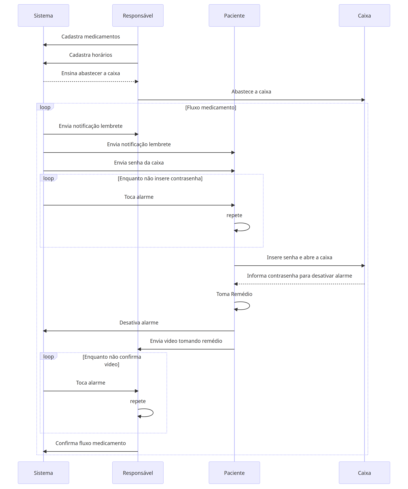

# Diagrama de sequência



### Mermaid
O diagrama de sequência pode ser editado no [mermaid](https://mermaid.live/). qualquer dúvida, basta seguir a [documentação](https://mermaid.js.org/syntax/sequenceDiagram.html) para editar

### Código fonte v20230904
```
sequenceDiagram
    participant Sistema
    participant Responsável
    participant Paciente
    participant Caixa
    Responsável->>Sistema: Cadastra medicamentos
    Responsável->>Sistema: Cadastra horários
    Sistema-->>Responsável: Ensina abastecer a caixa
    Responsável->>Caixa: Abastece a caixa
    loop Fluxo medicamento
        Sistema->>Responsável: Envia notificação lembrete
        Sistema->>Paciente: Envia notificação lembrete
        Sistema->>Paciente: Envia senha da caixa
        loop Enquanto não insere contrasenha
            Sistema->>Paciente: Toca alarme
            Paciente->>Paciente: repete
        end
        Paciente->>Caixa: Insere senha e abre a caixa
        Caixa-->>Paciente: Informa contrasenha para desativar alarme
        Paciente->>Paciente: Toma Remédio
        Paciente->>Sistema: Desativa alarme
        Paciente ->> Responsável: Envia video tomando remédio
        loop Enquanto não confirma video
            Sistema->>Responsável: Toca alarme
            Responsável->>Responsável: repete
        end
        Responsável->>Sistema: Confirma fluxo medicamento
    end
```
